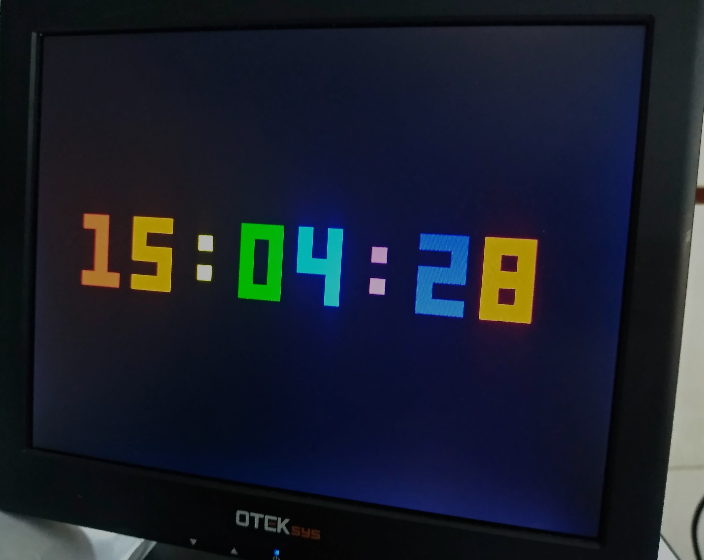
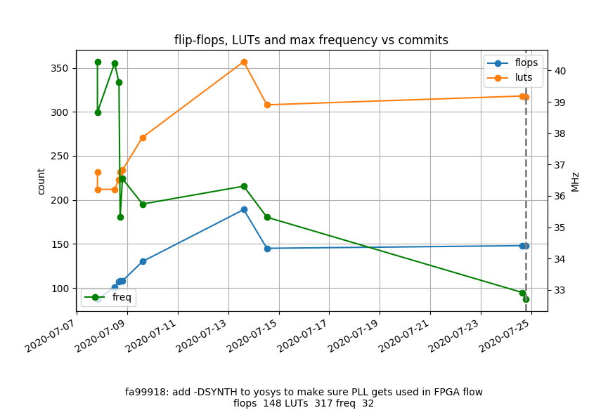
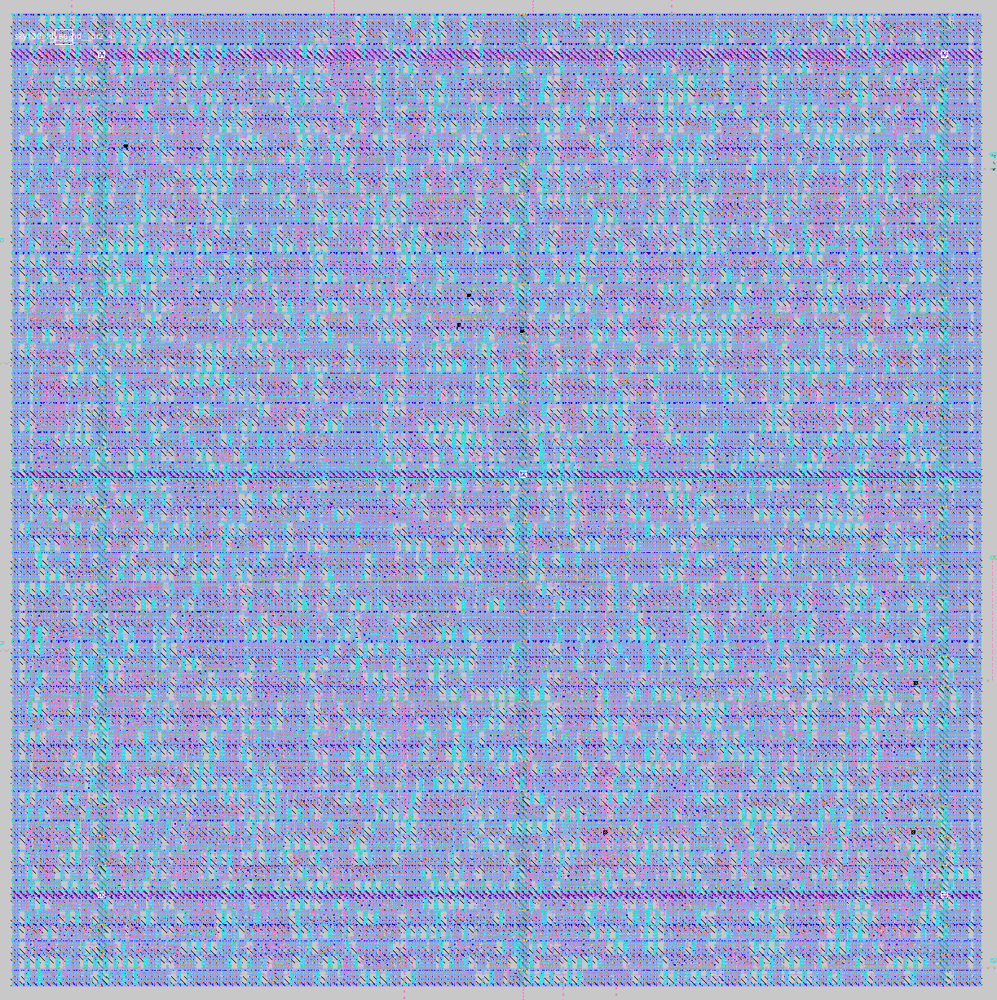
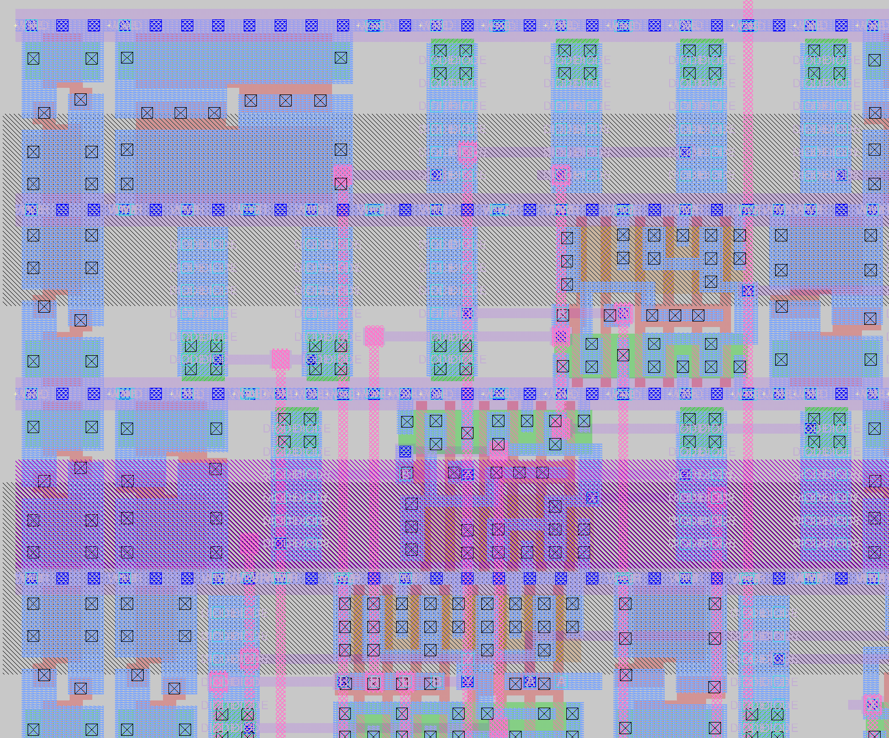

# VGA Clock

simple project to show the time on a 640x480 VGA display.

## FPGA Build instructions

It's setup to run on [1 Bit Squared icebreaker](https://1bitsquared.com/products/icebreaker) with my [VGA pmod](https://github.com/mattvenn/6bit-pmod-vga) plugged into pmod1a.

type

    make prog

to build & upload to the icebreaker

## FPGA utilisation

using [logLUTs](https://github.com/mattvenn/logLUTs) to record resource usage and max frequency over commits:

## ASIC utilisation

using the [Skywater/Google 130nm](https://github.com/google/skywater-pdk) process and [OpenLane](https://github.com/efabless/openlane)

* copy contents of rtl directory to designs/vga_clock/src/
* copy asic/config.tcl to designs/vga_clock/
* run ./flow.tcl vga_clock -init_design_config
* run ./flow.tcl -design vga_clock

This results in a routed design that uses 180x180 microns.

## License

This software and hardware is licensed under the [Apache License version 2](LICENSE-2.0.txt)
