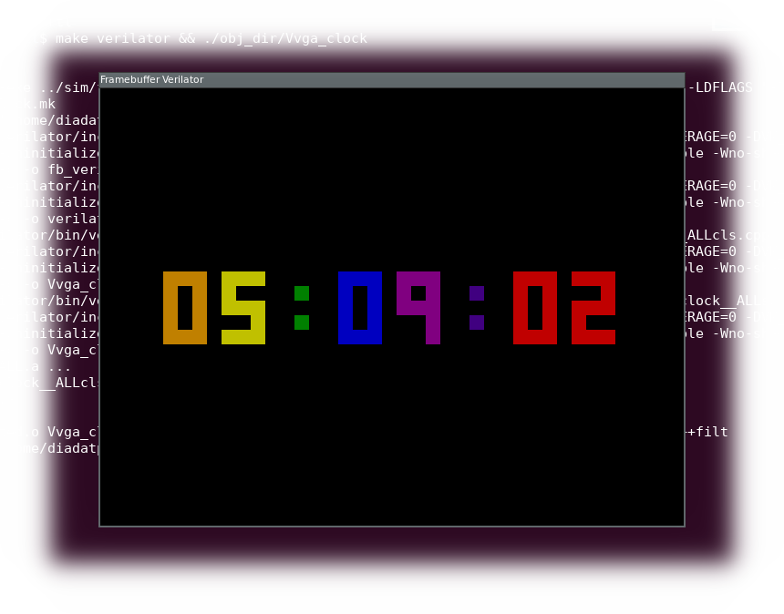

# VGA Clock

simple project to show the time on a 640x480 VGA display.

## Simulation instructions

Ensure that you have libsdl2-dev and verilator installed.

    sudo apt-get install libsdl2-dev libsdl2-image-dev verilator

To run the simulation use the following commands:

    cd rtl
    make verilator && ./obj_dir/Vvga_clock

Use the h, m and s keys to increment the hour, minute and second counters respectively.

## FPGA Build instructions

It's setup to run on [1 Bit Squared icebreaker](https://1bitsquared.com/products/icebreaker) with my [VGA pmod](https://github.com/mattvenn/6bit-pmod-vga) plugged into pmod1a.

type

    make prog

to build & upload to the icebreaker

## FPGA utilisation

using [logLUTs](https://github.com/mattvenn/logLUTs) to record resource usage and max frequency over commits:

## ASIC utilisation

using the [Skywater/Google 130nm](https://github.com/google/skywater-pdk) process and [OpenLane](https://github.com/efabless/openlane)

* copy contents of rtl directory to designs/vga_clock/src/
* remove digit_tb.v and top_tb.v from designs/vga_clock/src/ (I am working on separating test and rtl)
* copy asic/config.tcl to designs/vga_clock/
* inside the docker environment:
    * run ./flow.tcl -init_design_config -design vgaclock
    * run ./flow.tcl -design vga_clock

This results in a routed design that uses 180x180 microns.
View with klayout (from designs/vga_clock):

    klayout ./25-09_11-50/results/magic/vga_clock.gds -l $PDK_ROOT/open_pdks/sky130/klayout/sky130.lyp

View with magic (from designs/vga_clock):

    magic -rcfile $PDK_ROOT/sky130A/libs.tech/magic/sky130A.magicrc 25-09_11-50/results/magic/vga_clock.gds
    with the mouse outside of the design, press ctrl+i to select all, then type x to expand all the cells

## License

This software and hardware is licensed under the [Apache License version 2](LICENSE-2.0.txt)
